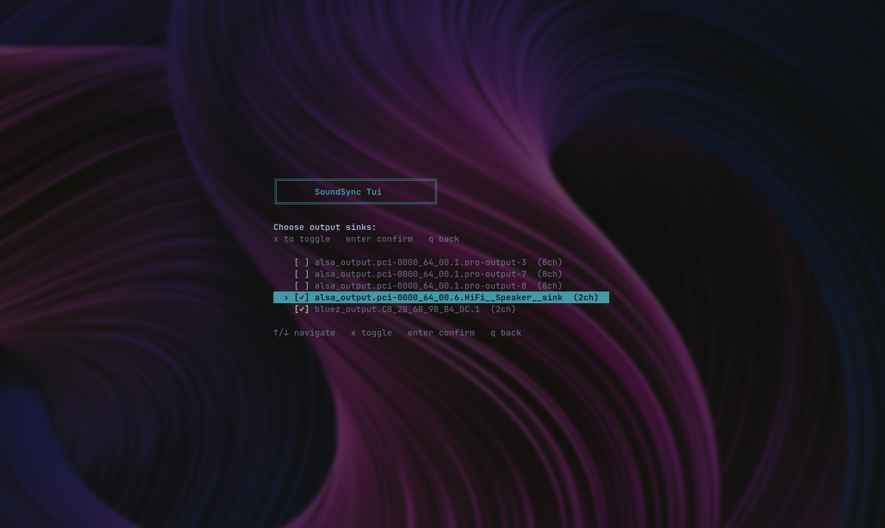
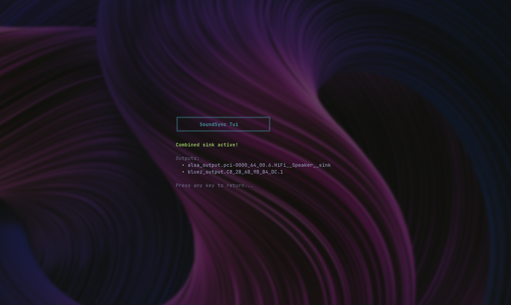
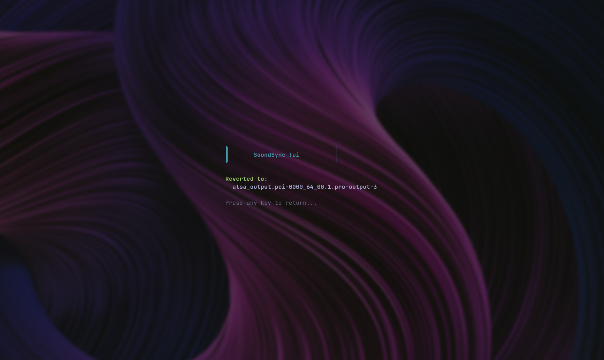

# SoundSync Tui

A minimal terminal UI for combining PulseAudio output sinks — route audio to multiple devices simultaneously (e.g. speakers + headphones) with a few keystrokes.


## Features

- Keyboard-driven TUI with centered layout and alternate screen buffer
- Scans and lists available PulseAudio sinks with their current state
- Activates `module-combine-sink` across any 2+ selected outputs
- Sets the combined sink as the default and moves all active audio streams to it
- Deactivates the combined sink and reverts to a fallback device

## Dependencies

- `bash`
- `pactl` (PulseAudio)
- `tput` (ncurses)
- `awk`, `sed`

## Usage

```sh
./SoundSyncTui
```

**Keybindings:**

| Key | Action |
|-----|--------|
| `↑` / `↓` | Navigate |
| `x` | Toggle sink selection |
| `Enter` | Confirm |
| `q` / `Q` | Quit / go back |

### Activate

Select **Activate** from the main menu, pick at least 2 sinks with `x`, then press `Enter`. The combined sink becomes the system default and all running streams are moved to it.





### Deactivate

Select **Deactivate** to unload the combined sink and automatically revert to the next available output.



## Installation

Copy the script to somewhere on your `$PATH` and make it executable:

```sh
cp SoundSyncTui ~/.local/bin/SoundSyncTui
chmod +x ~/.local/bin/SoundSyncTui
```
